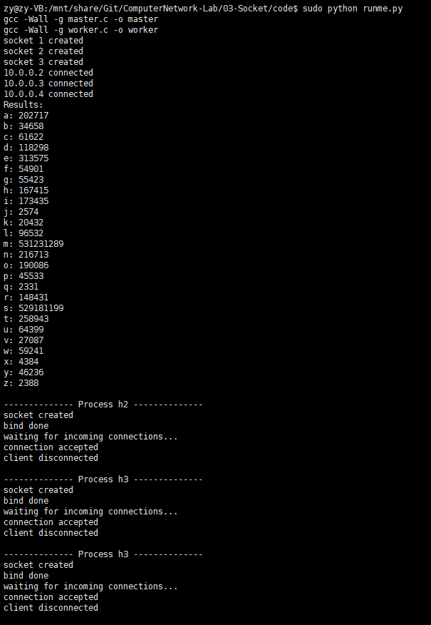

# Socket应用编程实验
- - -
## **实验内容**
使用BSD Socket API接口，实现一个基于socket的分布式字符统计程序。  
- **Master分发任务**
  * Master通过读取workers.conf配置文件，获取每个worker的IP地址，然后分别建立连接。
  - Master获取war_and_peace.txt文件长度，将统计任务等分到所有的worker。
  * Master给每个worker发送消息，包括如下内容：
    - 文件名长度（4个字节）
    - 文件所在位置（因为master和worker在同一主机同一目录，所以给出相对位置即可）
    - 需要进行字符统计的起始位置（4个字节）和终止位置（4个字节）。
- **Worker计算并返回结果**
  - 每个worker收到消息后，进行解析，根据指定统计区间对文件进行统计。
    - 只统计26个英文字符的个数，大写字符转换成小写后再统计。
  - Worker统计结束后，将每个字符出现的次数以4字节整数形式（网络字节序）返回给Master，因此传输消息长度为104字节。
  - Master收到所有worker的消息后，进行聚合并输出到屏幕。

## **实验步骤**
  **(1) 构造socket信息客户端master和服务器端worker**
  - master和worker的完整框架已由`example`中的`echo-client.c`和`echo-server.c`给出。对应关系为：client -> master, server -> worker。 
    **(2) 预处理传输的消息**
  - 修改master和worker收发消息为如下数据结构：  
  ```c
    typedef struct message
    {
        int fname_len;         // length of file's name
        char location[100];    // master-> worker
        int start;             // start position to count letters
        int end;               // end position of counting
    } send_msg;
  ```
  - 统计消息行数
  ```c
    //read txt file
    if (argc == 1) {
        printf("No files to read.\n");
        return -1;
    } 
    FILE * fp = fopen(argv[1], "r");

    //count lines of txt file
    char buffer[2000];
    int line;
    for (line = 0; !feof(fp); line ++) {
        fgets(buffer, sizeof(buffer), fp);
        memset(buffer, 0, sizeof(buffer));
    }
  ```
  **(3) Master发送数据**
  - Master循环遍历`msg`，每次循环修改发送消息的起始位置和发送位置，为每个worker发送消息。
  ```c
    // initialize message
    send_msg msg;
    msg.fname_len = strlen(argv[1]);
    memset(msg.location, 0, sizeof(msg.location));
    strcat(msg.location, "./");
    strcat(msg.location, argv[1]);

    for(msg.start = 0, j = 0; j < WORKER_NUM; j++, msg.start += line / WORKER_NUM)
    {
        msg.end = msg.start + line/2;

        // send data
        if (send(sock[j], (char *) & msg, sizeof(msg), 0) < 0) {
            printf("send failed\n");
            return -1;
        }
    }
  ```
  **(4) worker接收消息（采用IO多路复用技术）**
  - 由于Master串行等待worker回传信息，因此利用并发技术，理论上可将运行时间缩短为原来的1/WORKER_NUM。
  - 查阅资料，使用`select`系统调用，对socket进行线性扫描，即采用轮询的方法，调度socket，代码如下：
  ```c
        // receive a reply from the workers: use IO mutiplexing
        int reply[26];
        int workers_reply[WORKER_NUM][26] = {0};
        int finish_workers_num = 0;
        int finish_workers[100] = {0};
        fd_set rfds;

        while (finish_workers_num < WORKER_NUM)
        {
            int max_fd = -1;
            FD_ZERO(&rfds);
            for (int i = 0; i < WORKER_NUM; i ++)
            {
                if (finish_workers[i] == 0)
                    FD_SET(sock[i], &rfds);
                max_fd = sock[i] > max_fd ? sock[i] : max_fd;
            }
            if (select(max_fd + 1, &rfds, NULL, NULL, NULL) > 0)
            {
                for (int i = 0; i < WORKER_NUM; i ++) 
                {
                    if (FD_ISSET(sock[i], &rfds))
                    {
                        if (recv(sock[i], workers_reply[i], sizeof(workers_reply[i]), 0) < 0) {
                            printf("recv failed\n");
                            return -1;
                        }

                        finish_workers_num ++;
                        finish_workers[i] = 1;

                        for (int j = 0; j < 26; j ++)
                            reply[j] += workers_reply[i][j];
                    }
                }
            }
        }
  ```
  **(5) wroker统计字符数**
  - 在worker中循环遍历`msg`，将统计结果写入`reply`数组中。
  ```c
    void record(char * msg, int reply[])
    {
        int i, j;
        // convert uppercase to lowercase
        for (i = 0; i < strlen(msg); i ++)
            msg[i] = (msg[i] >= 'A' && msg[i] <= 'Z') ? msg[i] - 'A' + 'a' : msg[i];
        
        // record numbers of 26 letters
        for (i = 0; i < strlen(msg); i ++)
        {
            if (msg[i] >= 'a' && msg[i] <= 'z') 
            {
                j = msg[i] - 'a';
                ++ reply[j];
            }
        }
        return;
    }
  ```
## **实验结果**
- 基于`topo.py`的python自动运行脚本：  
    ````python
    #!/usr/bin/python

    from mininet.node import OVSBridge
    from mininet.net import Mininet
    from mininet.topo import Topo
    from mininet.link import TCLink
    from mininet.cli import CLI
    import os

    nworkers = 3

    class MyTopo(Topo):
        def build(self):
            s1 = self.addSwitch('s1')

            hosts = list()
            for i in range(1, nworkers+2):
                h = self.addHost('h' + str(i))
                hosts.append(h)

            for h in hosts:
                self.addLink(h, s1)

    os.system("make")

    topo = MyTopo()
    net = Mininet(topo = topo, switch = OVSBridge, controller = None)

    net.start()
    # CLI(net) 

    h1, h2, h3, h4 = net.get('h1', 'h2', 'h3', 'h4')
    h2.cmd('./worker > h2.txt &')
    h3.cmd('./worker > h3.txt &')
    h4.cmd('./worker > h4.txt &')
    print h1.cmd('./master war_and_peace.txt')

    net.stop()

    print("-------------- Process h2 --------------")
    os.system("cat h2.txt")
    print("\n-------------- Process h3 --------------")
    os.system("cat h3.txt")
    print("\n-------------- Process h3 --------------")
    os.system("cat h4.txt")

    os.system("make clean")
    ```
- 运行`sudo python runme.py`，结果如下：  
      
    经对比，与reference运行结果相同。  

## **参考资料**
1. [聊聊IO多路复用之select、poll、epoll详解.简书](https://www.jianshu.com/p/dfd940e7fca2) 
2. [IO多路复用之select函数详解.CSDN](https://blog.csdn.net/lixungogogo/article/details/52219951)