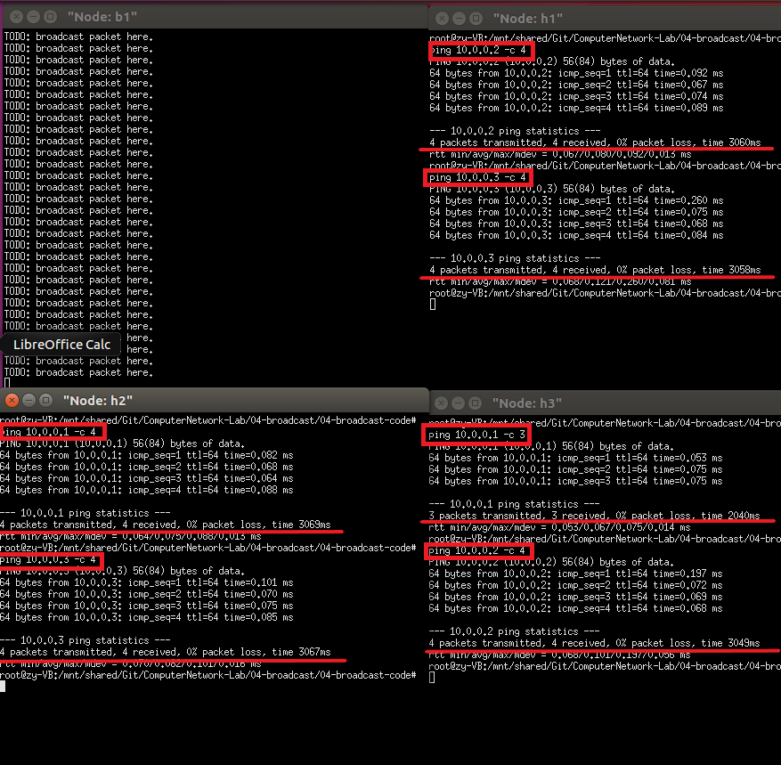
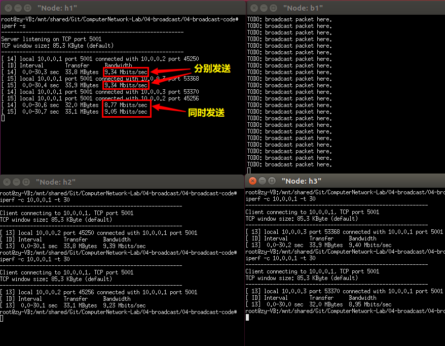
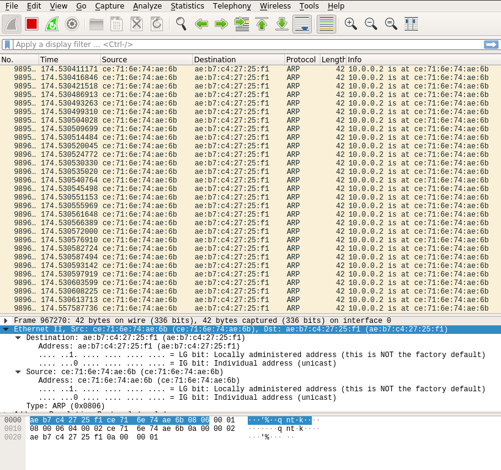

# 广播网络实验报告
- - -
## 实验内容
- 实现节点广播的broadcast_packet函数
- 验证广播网络能够正常运行
  - 从一个端节点ping另一个端节点
- 验证广播网络的效率
  - 在three_nodes_bw.py进行iperf测量
  - 两种场景：H1: iperf client; H2, H3: servers；H1: iperf server; H2, H3: clients
- 构建环形拓扑，验证该拓扑下节点广播会产生数据包环路
## 实验步骤
- 实现`main.c`中的`broadcast_packet`函数。  
- 具体方法为：遍历链表`instance->iface_list`，判断当两个端口不同时，利用`iface_send_packet`函数发送数据包。
  ```c
    void broadcast_packet(iface_info_t *iface, const char *packet, int len)
    {
        // TODO: broadcast packet 
        fprintf(stdout, "TODO: broadcast packet here.\n");
        iface_info_t *ifaces = NULL;
        list_for_each_entry(ifaces, &instance->iface_list, list) {
            if(ifaces != iface) {
                iface_send_packet(ifaces, packet, len);
            }
        }
    }
  ```
## 实验结果及分析
 #### 验证广播网络能够正常运行
 - 终端命令
    ```assembler
    b1 # ./hub
    h2, h3 # ping 10.0.0.1 -c 4  
    h1, h3 # ping 10.0.0.2 -c 4 
    h1, h2 # ping 10.0.0.3 -c 4 
    ```
 - 结果如下`Filgure-1`所示：  

  - **结果分析**  
    由Figure-1可观察到，三个结点h1, h2, h3分别与交换机b1连接，并相互`ping`成功，三个结点之间双向连通，验证了广播网络的正常运行。
- #### 验证广播网络的效率
  - 终端命令
  ```
  Server # iperf -s
  Client # iperf -c 10.0.0.X -t 30
  ```
  - **H1: iperf client; H2, H3: iperf servers**  
    结果如下`Figure-2`所示：  

  - **H1: iperf server; H2, H3: iperf clients**  
    结果如下`Figure-3`所示：  

  - **结果分析**  
    
    -  由Figure-2可观察到，当H1分别`iperf H2/H3`时，带宽均接近10MB/s；同时`iperf H2/H3`时，带宽均有减少，且带宽和约为10MB/s。带宽减小的原因为：当H1作为客户端**同时**`iperf`H2/H3时，H1发送给H2的数据包会同时由hub广播给H3，与H1发送给H3的数据包的路径相同，两者共同占用链路hub->H3的带宽；同理，链路hub->H2的带宽也被共同占用，因此H1同时`iperf H2/H3`的带宽之和约为10MB/s。
    - 由Figure-3可观察到，H2/H3无论分别`iperf H1`还是同时`iperf H1`，带宽均约为10MB/s。因为当H2/H3作为客户端**同时**向服务器H1发送数据包时，H2广播的数据包也会由hub传播给H3，但是这并占用H3->hub发包的带宽，H3的广播同理。因此，H2，H3有效利用了H2/H3->hub, hub->H1的10MB/s、20MB/s带宽，发挥了最大性能。
- #### 验证环形拓扑下结点广播会产生数据包环路
  - **编写环形拓扑**  
  见文件`cycle_topo.py`，将三个hub结点b1, b2, b3两两相连，主机结点h1连b1，h2连b2。
  ```python
  class BroadcastTopo(Topo):
    def build(self):
        h1 = self.addHost('h1')
        h2 = self.addHost('h2')
        b1 = self.addHost('b1')
        b2 = self.addHost('b2')
        b3 = self.addHost('b3')

        self.addLink(h1, b1)
        self.addLink(h2, b2)
        self.addLink(b2, b3)
        self.addLink(b3, b1)
        self.addLink(b2, b1)
  ```
  - 执行`h1 # ping 10.0.0.2 -c 1`，wireshark抓包结果如下`Figure-4`所示：：  
  
  - **结果分析**  
  由Figure-5可观察到，ARP协议包在环路中被不停转发，验证了该拓扑下节点广播会产生数据包环路。
  