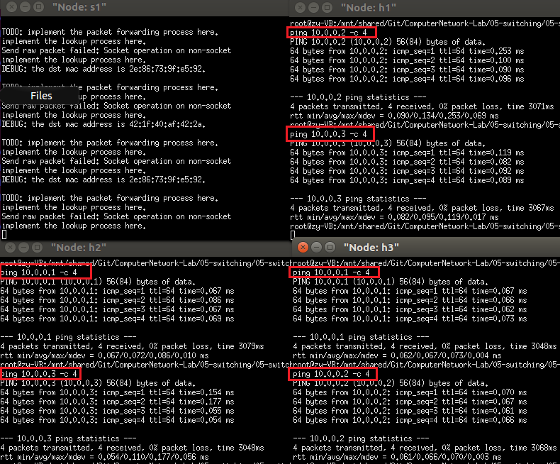
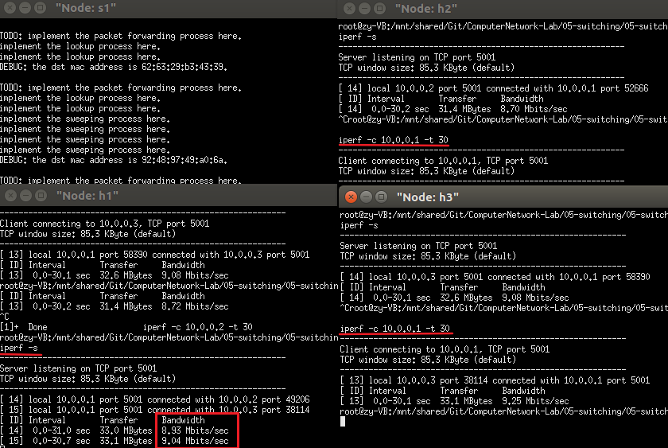
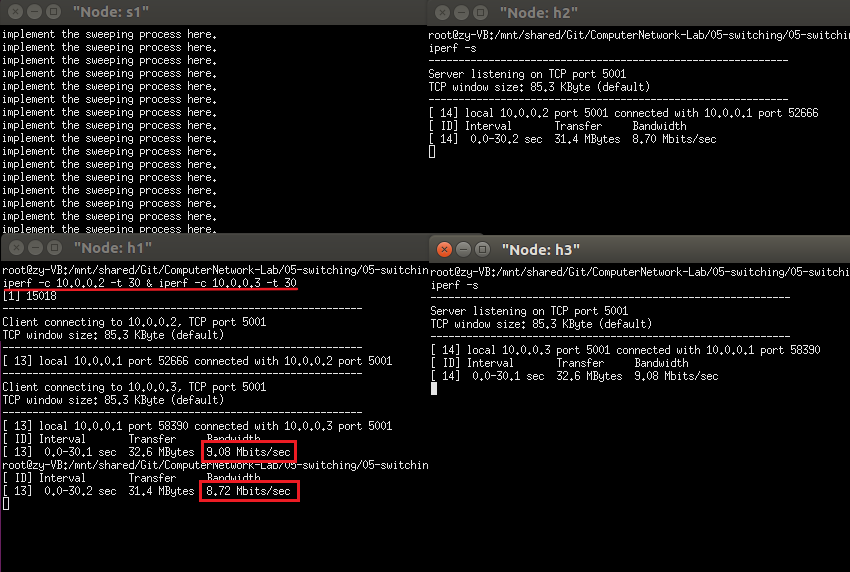
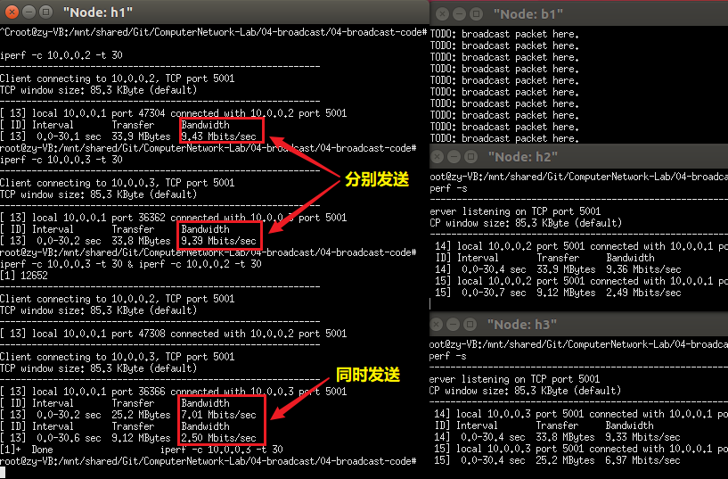
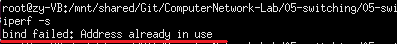

# 交换机转发实验报告 
- - -
## 实验内容
- 实现一个具有转发表学习功能的交换机，使得连接到同一交换机的主机可以相互通信。
- 实现对数据结构mac_port_map的所有操作(包括查询操作lookup_port、插入操作insert_mac_port和老化操作sweep_aged_mac_port_entry)，以及数据包的转发handle_packet和广播broadcast_packet操作。
- 使用iperf和给定的拓扑进行实验，对比交换机转发与集线器广播的性能。
## 实验步骤
##### 1. 补全mac.c中对mac_port_map的三种操作
- **查找 lookup_port**
  - 利用`hash8`函数可得出`mac`的hash值，可在hash链表中进行快速查找，查找成功后需要更新访问时间`visited`。代码如下：  
  ```c
    iface_info_t *lookup_port(u8 mac[ETH_ALEN])
    {
        // TODO: implement the lookup process here
        fprintf(stdout, "implement the lookup process here.\n");

        mac_port_entry_t * entry = NULL;
        iface_info_t * result = NULL;

        pthread_mutex_lock(&mac_port_map.lock);
        list_for_each_entry(entry, &mac_port_map.hash_table[hash8((char *)mac, sizeof(u8) * ETH_ALEN)], list) 
        {
            if (!memcmp(entry->mac, mac, ETH_ALEN * sizeof(u8))) 
            {
                // if found, get its iface info and the time
                entry->visited = time(NULL);
                result = entry->iface;
                break;
            }
        }
        pthread_mutex_unlock(&mac_port_map.lock);

        return result;
    }
  ```

- **插入 insert_mac_port**
  - 先分配一个新的`entry`结点，初始化后用`list_add_tail`函数将其插入到链表中。代码如下：  
  ```c
    void insert_mac_port(u8 mac[ETH_ALEN], iface_info_t *iface)
    {
        // TODO: implement the insertion process here
        fprintf(stdout, "implement the insertion process here.\n");

        // initialize a new entry
        mac_port_entry_t * entry = (mac_port_entry_t *)malloc(sizeof(mac_port_entry_t));
        entry->iface = iface;
        entry->visited = time(NULL);
        memcpy(entry->mac, mac, sizeof(u8) * ETH_ALEN);
        u8 hash_val = hash8((char *)mac, sizeof(u8) * ETH_ALEN);

        pthread_mutex_lock(&mac_port_map.lock);
        // add entry into list
        list_add_tail(&entry->list, &mac_port_map.hash_table[hash_val]);
        pthread_mutex_unlock(&mac_port_map.lock);
    }
  ```

- **老化 sweep_aged_mac_port_entry**
  - 遍历hash表，用`list_delete_entry`函数删除老化的结点。代码如下：  
  ```c
    int sweep_aged_mac_port_entry()
    {
        // TODO: implement the sweeping process here
        fprintf(stdout, "implement the sweeping process here.\n");

        mac_port_entry_t *entry, *q;
        time_t now = time(NULL);
        int count = 0;

        pthread_mutex_lock(&mac_port_map.lock);
        for (int i = 0; i < HASH_8BITS; i++) 
        {
            list_for_each_entry_safe(entry, q, &mac_port_map.hash_table[i], list) 
            {
                if (now - entry->visited >= MAC_PORT_TIMEOUT) 
                {
                    // delete the entry
                    list_delete_entry(&entry->list);
                    free(entry);
                    ++ count;
                }
            }
        }
        pthread_mutex_unlock(&mac_port_map.lock);

        return count;
    }
  ```

##### 2. 实现交换机处理数据包的函数handle_packet
  代码如下：
  ```c
    void handle_packet(iface_info_t *iface, char *packet, int len)
    {
        struct ether_header *eh = (struct ether_header *)packet;
        log(DEBUG, "the dst mac address is " ETHER_STRING ".\n", ETHER_FMT(eh->ether_dhost));

        // TODO: implement the packet forwarding process here
        fprintf(stdout, "TODO: implement the packet forwarding process here.\n");
        iface_info_t * result = lookup_port(eh->ether_dhost);
        
        if (result) 
        {
            iface_send_packet(result, packet, len);
        } 
        else 
        {
            broadcast_packet(iface, packet, len);
        }
        
        if (!lookup_port(eh->ether_shost)) 
        {
            insert_mac_port(eh->ether_shost, iface);
        }
    }
  ```

##### 3. 实现数据包的广播函数
  该函数在广播实验中已实现，代码如下：
  ```c
    void broadcast_packet(iface_info_t *iface, char *packet, int len)
    {
        // TODO: implement the broadcast process here
        fprintf(stdout, "TODO: implement the broadcast process here.\n");
        
        iface_info_t *ifaces = NULL;
        list_for_each_entry(ifaces, &instance->iface_list, list) 
        {
            if(ifaces != iface) 
            {
                iface_send_packet(ifaces, packet, len);
            }
        }
    }
  ```

## 实验结果及分析
- **各个节点相互ping通**  
  结果如下：  
    
- **H1: iperf client; H2, H3: iperf servers**  
  下图为交换机实验的结果图：  
    
  由图可知，两者带宽均接近10Mb/s。因为H2和H3共同占用了H1到交换机的20Mb/s带宽，和它们各自到S1的10Mb/s带宽，发挥了最大效能。  
  此结果与广播实验一样。

- **H1: iperf client; H2, H3: iperf servers**  
  下图为交换机实验的结果图：  
    
  下图为广播实验的结果图：  
    
  对比得知，当H1同时向H2/H3发送数据包时，广播实验中两者带宽之和约为10MB/s，交换机实验中两者均为10MB/s左右，最大化利用了链路带宽。   
  这是因为在交换机实验中，H2/H3的mac地址均存储在转发表中，发送给H2的数据包到达交换机时，会直接发送到对应的目的地址，不需要向H3广播，因此不占用H3接收数据包链路S1->H3的带宽，链路S1->H2同理，所以这两个链路可以发挥最大带宽10MB/s的性能。相比广播，交换机提高了性能。

## 错误记录
  实验中进行iperf测试时，在H2/H3中输入`iperf -s`，会报如下图错误：  
    
  查阅相关资料，并没有找到明确的解决方案，尝试了修改H1/H2/H3的IP地址、重新编译、`kill`进程等办法，最后通过注释掉`three_nodes_bw.py`中的部分代码：  

  ```python
    s1.cmd('./switch-reference &')
    h2.cmd('iperf -s &')
    h3.cmd('iperf -s &')
  ```
  xterm使用`exit`命令退出(之前使用逐个关掉s1, h1/2/3，然后`quit`命令的方式退出)，并且修改了一些bug后，成功进行iperf测试。但是仍不太清楚造成这个错误的具体原因是什么。

## 参考资料
  1. [Address already in use .端口占用的错误](https://blog.csdn.net/qq_42327755/article/details/80556243)  
  2. [Linux下Socket编程的端口问题(Bind error: Address already in use)](http://www.cnblogs.com/hnrainll/archive/2011/10/14/2211150.html)