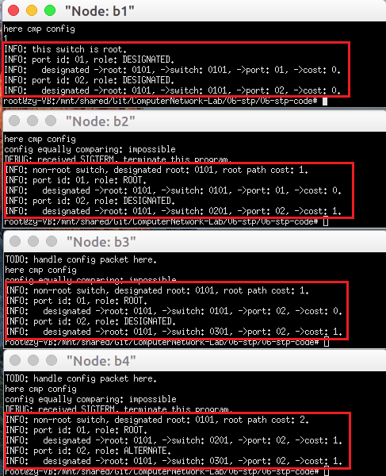
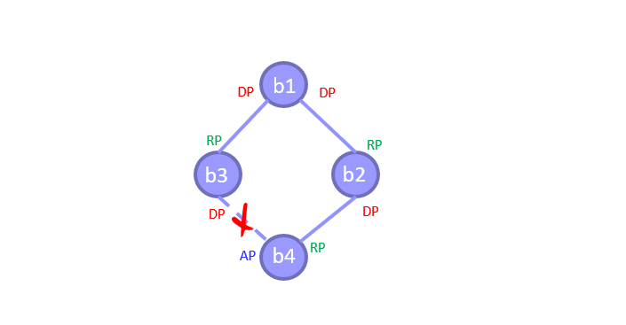
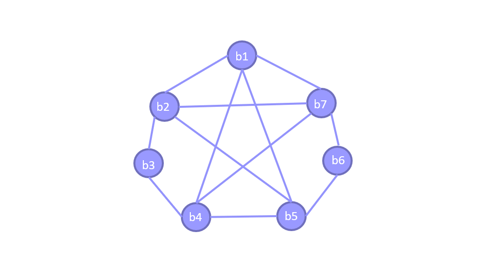
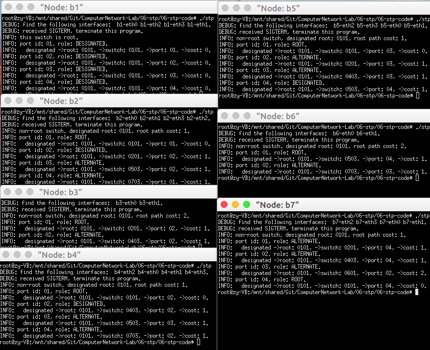
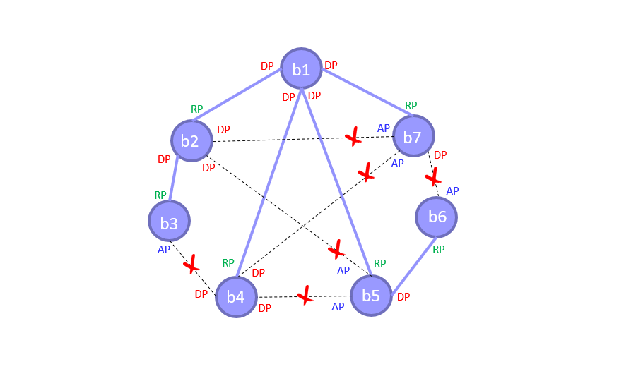

# 生成树机制实验
- - -
## 实验内容
- 基于已有代码，实现生成树运行机制，对于给定拓扑(four_node_ring.py)计算输出相应状态下的最小生成树拓扑。
- 构造一个不少于7个节点，冗余链路不少于2条的拓扑，节点和端口的命名规则可参考four_node_ring.py，使用stp程序计算输出最小生成树拓扑。
## 实验步骤
本次实验只需完成stp_handle_config_packet函数，即处理Config消息的功能。
##### 1. 将收到的Config消息与本端口Config进行优先级比较
  - Config之间的优先级比较遵循以下规则：
    - 如果两者认为的根节点ID不同，则根节点ID小的一方优先级高；  
    - 如果两者到根节点的开销不同，则开销小的一方优先级高；  
    - 如果两者到根节点的上一跳节点不同，则上一跳节点ID小的一方优先级高；如果两者到根节点的上一跳端口不同，则上一跳端口ID小的一方优先级高。  
  - 优先级比较函数如下：  
  ```c
    int cmp_config_priority(stp_port_t *p, struct stp_config *config)
    {
        // if config's priority > p's, return TRUE
        if (ntohll(config->root_id) != p->designated_root)	
            return (ntohll(config->root_id) < p->designated_root) ? 1 : 0;
        else if (ntohl(config->root_path_cost) != p->designated_cost)
            return (ntohl(config->root_path_cost) < p->designated_cost) ? 1 : 0;
        else if (ntohll(config->switch_id) != p->designated_switch)
            return (ntohll(config->switch_id) < p->designated_switch) ? 1 : 0;
        else if (ntohs(config->port_id) != p->designated_port)
            return (ntohs(config->port_id) < p->designated_port) ? 1 : 0;
        return 0;
    }
  ```

##### 2. 收到的Config优先级高的情况处理
如果收到的Config优先级高，说明该网段通过对方端口连接根节点开销更小，则进行以下操作：
- 将本端口的Config替换为收到的Config消息，本端口为非指定端口；
- 更新节点状态(①)，更新剩余端口的Config(②)；
  - ①更新结点状态
    - 遍历所有端口，满足如下条件的为根端口(root_port)
      - 该端口是非指定端口
      - 该端口的优先级要高于所有剩余非指定端口
    - 如果不存在根端口，则该节点为根节点。
    - 否则，选择通过root_port连接到根节点，更新节点状态。
    - 代码如下：  
    ```c
        // update stp state
		stp->root_port = NULL;
		for (int i = 0; i < stp->nports; i ++) {
			if (stp_port_is_designated(&stp->ports[i]))  
				continue;				
			if ( stp->root_port == NULL || (stp->root_port != NULL \
			     && cmp_port_priority(&stp->ports[i], stp->root_port) > 0))
				stp->root_port = &stp->ports[i];			
		}
		if (stp->root_port == NULL) {
			// cannot find desire root port
			stp->designated_root = stp->switch_id;
			stp->root_path_cost = 0;
		} else {
			stp->designated_root = stp->root_port->designated_root;
			stp->root_path_cost = stp->root_port->designated_cost + stp->root_port->path_cost;
		}
    ```

  - ②更新剩余端口的Config
    - 如果一个端口为非指定端口，且其网段通过本节点到根节点的开销比通过对端节点的开销小，那么该端口成为指定端口。
    - 对于所有指定端口，更新其认为的根节点和路径开销。
    - 代码如下：  
    ```c
        // update rest config 
		stp_port_t * port_i;
		for (int i = 0; i < stp->nports; i ++) {
			port_i = &stp->ports[i];	
			if (port_i == p) continue;
			if (stp_port_is_designated(port_i)) {
				port_i->designated_root = stp->designated_root;
				port_i->designated_cost = stp->root_path_cost;
			} else {
				if (stp->root_path_cost < port_i->designated_cost) {
					port_i->designated_switch = stp->switch_id;
					port_i->designated_port = p->port_id;
				}
			}			
		}
    ```

- 如果节点由根节点变为非根节点，停止hello定时器；
  
  - 初始情况下均为根节点，如果某端口遇到更优的config信息，就说明它一定不是根节点，所以只要比较得出config优先级高，则停掉hello计时器。
  
- 将更新后的Config从每个指定端口转发出去。

##### 3. 本端口Config优先级高的情况处理
- 如果本端口Config优先级高，说明该网段通过本端口连接根节点开销更小，该端口是指定端口，发送Config消息。
  
##### 4. 完整stp_handle_config_packet函数
```c
    static void stp_handle_config_packet(stp_t *stp, stp_port_t *p, struct stp_config *config)
    {
        // TODO: handle config packet here
        // fprintf(stdout, "TODO: handle config packet here.\n");
        
        // compare priority of configs
        if (cmp_config_priority(p, config)) {
            // replace config
            p->designated_root = ntohll(config->root_id);
            p->designated_port = ntohs(config->port_id);
            p->designated_cost = ntohl(config->root_path_cost);
            p->designated_switch = ntohll(config->switch_id);

            // update stp state
            stp->root_port = NULL;
            for (int i = 0; i < stp->nports; i ++) {
                if (stp_port_is_designated(&stp->ports[i]))  
                    continue;				
                if ( stp->root_port == NULL || (stp->root_port != NULL \
                    && cmp_port_priority(&stp->ports[i], stp->root_port) > 0))
                    stp->root_port = &stp->ports[i];			
            }
            if (stp->root_port == NULL) {
                // cannot find desire root port
                stp->designated_root = stp->switch_id;
                stp->root_path_cost = 0;
            } else {
                stp->designated_root = stp->root_port->designated_root;
                stp->root_path_cost = stp->root_port->designated_cost + stp->root_port->path_cost;
            }

            // update rest config 
            stp_port_t * port_i;
            for (int i = 0; i < stp->nports; i ++) {
                port_i = &stp->ports[i];	
                if (port_i == p) continue;
                if (stp_port_is_designated(port_i)) {
                    port_i->designated_root = stp->designated_root;
                    port_i->designated_cost = stp->root_path_cost;
                } else {
                    if (stp->root_path_cost < port_i->designated_cost) {
                        port_i->designated_switch = stp->switch_id;
                        port_i->designated_port = p->port_id;
                    }
                }			
            }
            // stop hello timer
            stp_stop_timer(&stp->hello_timer);
            
            // send new config from designated port
            stp_send_config(stp);

        } else {
            stp_port_send_config(p);
        }
    }
```

## 实验结果
##### 1. 利用四结点环路验证STP函数
验证结果如下：  


  

```
    # ./dump_output.sh 4
    NODE b1 dumps:
    INFO: this switch is root.
    INFO: port id: 01, role: DESIGNATED.
    INFO: 	designated ->root: 0101, ->switch: 0101, ->port: 01, ->cost: 0.
    INFO: port id: 02, role: DESIGNATED.
    INFO: 	designated ->root: 0101, ->switch: 0101, ->port: 02, ->cost: 0.

    NODE b2 dumps:
    INFO: non-root switch, designated root: 0101, root path cost: 1.
    INFO: port id: 01, role: ROOT.
    INFO: 	designated ->root: 0101, ->switch: 0101, ->port: 01, ->cost: 0.
    INFO: port id: 02, role: DESIGNATED.
    INFO: 	designated ->root: 0101, ->switch: 0201, ->port: 02, ->cost: 1.

    NODE b3 dumps:
    INFO: non-root switch, designated root: 0101, root path cost: 1.
    INFO: port id: 01, role: ROOT.
    INFO: 	designated ->root: 0101, ->switch: 0101, ->port: 02, ->cost: 0.
    INFO: port id: 02, role: DESIGNATED.
    INFO: 	designated ->root: 0101, ->switch: 0301, ->port: 02, ->cost: 1.

    NODE b4 dumps:
    INFO: non-root switch, designated root: 0101, root path cost: 2.
    INFO: port id: 01, role: ROOT.
    INFO: 	designated ->root: 0101, ->switch: 0201, ->port: 02, ->cost: 1.
    INFO: port id: 02, role: ALTERNATE.
    INFO: 	designated ->root: 0101, ->switch: 0301, ->port: 02, ->cost: 1.
```
得到课件中的网络结构：  


##### 2. 构造七结点网络拓扑验证STP函数
构造的七结点拓扑结构如下图(代码见`seven_node_topo.py`文件)：  
  
运行生成树函数的结果：  


```
    # ./dump_output.sh 7
    NODE b1 dumps:
    INFO: this switch is root.
    INFO: port id: 01, role: DESIGNATED.
    INFO: 	designated ->root: 0101, ->switch: 0101, ->port: 01, ->cost: 0.
    INFO: port id: 02, role: DESIGNATED.
    INFO: 	designated ->root: 0101, ->switch: 0101, ->port: 02, ->cost: 0.
    INFO: port id: 03, role: DESIGNATED.
    INFO: 	designated ->root: 0101, ->switch: 0101, ->port: 03, ->cost: 0.
    INFO: port id: 04, role: DESIGNATED.
    INFO: 	designated ->root: 0101, ->switch: 0101, ->port: 04, ->cost: 0.

    NODE b2 dumps:
    INFO: non-root switch, designated root: 0101, root path cost: 1.
    INFO: port id: 01, role: ROOT.
    INFO: 	designated ->root: 0101, ->switch: 0101, ->port: 01, ->cost: 0.
    INFO: port id: 02, role: DESIGNATED.
    INFO: 	designated ->root: 0101, ->switch: 0201, ->port: 02, ->cost: 1.
    INFO: port id: 03, role: DESIGNATED.
    INFO: 	designated ->root: 0101, ->switch: 0201, ->port: 03, ->cost: 1.
    INFO: port id: 04, role: DESIGNATED.
    INFO: 	designated ->root: 0101, ->switch: 0201, ->port: 04, ->cost: 1.

    NODE b3 dumps:
    INFO: non-root switch, designated root: 0101, root path cost: 2.
    INFO: port id: 01, role: ROOT.
    INFO: 	designated ->root: 0101, ->switch: 0201, ->port: 02, ->cost: 1.
    INFO: port id: 02, role: ALTERNATE.
    INFO: 	designated ->root: 0101, ->switch: 0403, ->port: 02, ->cost: 1.

    NODE b4 dumps:
    INFO: non-root switch, designated root: 0101, root path cost: 1.
    INFO: port id: 01, role: ROOT.
    INFO: 	designated ->root: 0101, ->switch: 0101, ->port: 02, ->cost: 0.
    INFO: port id: 02, role: DESIGNATED.
    INFO: 	designated ->root: 0101, ->switch: 0403, ->port: 02, ->cost: 1.
    INFO: port id: 03, role: DESIGNATED.
    INFO: 	designated ->root: 0101, ->switch: 0403, ->port: 03, ->cost: 1.
    INFO: port id: 04, role: DESIGNATED.
    INFO: 	designated ->root: 0101, ->switch: 0403, ->port: 04, ->cost: 1.

    NODE b5 dumps:
    INFO: non-root switch, designated root: 0101, root path cost: 1.
    INFO: port id: 01, role: ROOT.
    INFO: 	designated ->root: 0101, ->switch: 0101, ->port: 03, ->cost: 0.
    INFO: port id: 02, role: ALTERNATE.
    INFO: 	designated ->root: 0101, ->switch: 0201, ->port: 03, ->cost: 1.
    INFO: port id: 03, role: ALTERNATE.
    INFO: 	designated ->root: 0101, ->switch: 0403, ->port: 03, ->cost: 1.
    INFO: port id: 04, role: DESIGNATED.
    INFO: 	designated ->root: 0101, ->switch: 0503, ->port: 04, ->cost: 1.

    NODE b6 dumps:
    INFO: non-root switch, designated root: 0101, root path cost: 2.
    INFO: port id: 01, role: ROOT.
    INFO: 	designated ->root: 0101, ->switch: 0503, ->port: 04, ->cost: 1.
    INFO: port id: 02, role: ALTERNATE.
    INFO: 	designated ->root: 0101, ->switch: 0703, ->port: 03, ->cost: 1.

    NODE b7 dumps:
    INFO: non-root switch, designated root: 0101, root path cost: 1.
    INFO: port id: 01, role: ALTERNATE.
    INFO: 	designated ->root: 0101, ->switch: 0201, ->port: 04, ->cost: 1.
    INFO: port id: 02, role: ALTERNATE.
    INFO: 	designated ->root: 0101, ->switch: 0403, ->port: 04, ->cost: 1.
    INFO: port id: 03, role: DESIGNATED.
    INFO: 	designated ->root: 0101, ->switch: 0703, ->port: 03, ->cost: 1.
    INFO: port id: 04, role: ROOT.
    INFO: 	designated ->root: 0101, ->switch: 0101, ->port: 04, ->cost: 0.
```
所构造的开销最小的树状拓扑如下：  
  

## 结果分析
根据上图的检验，可见生成的网络结构为树状，且没有冗余环路，结果正确。  
生成树算法确实可以从逻辑上避免环路，避免广播风暴。