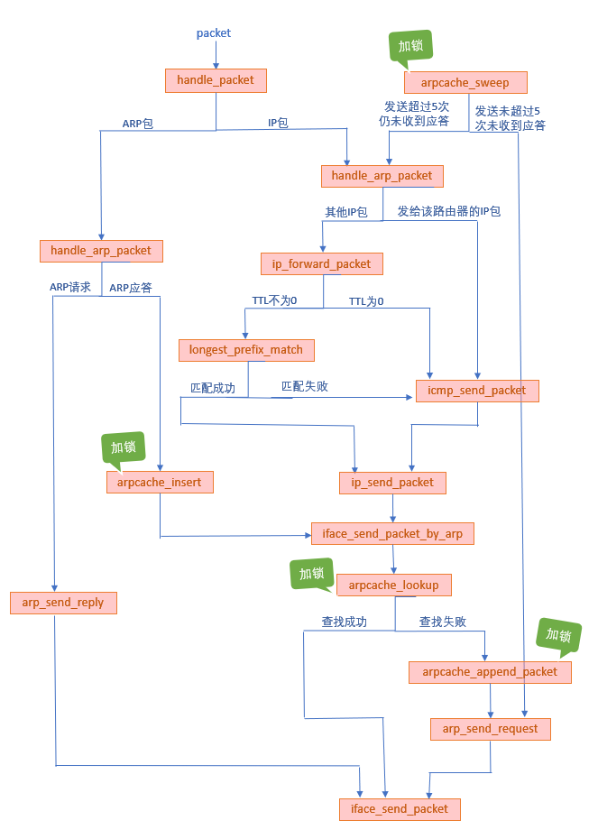
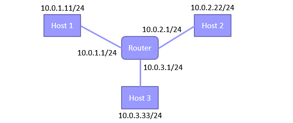
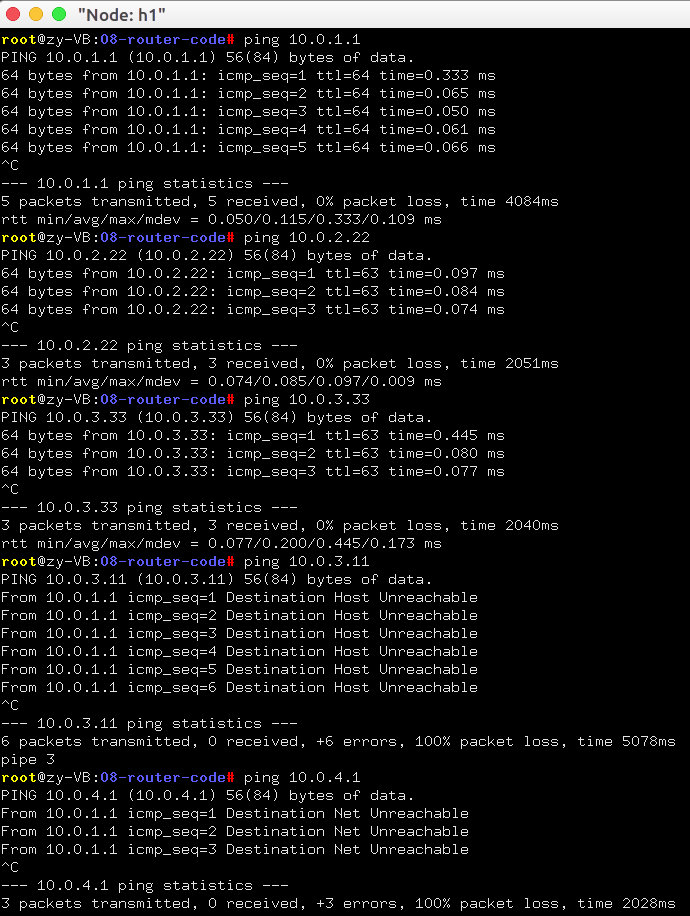
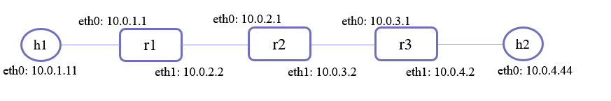
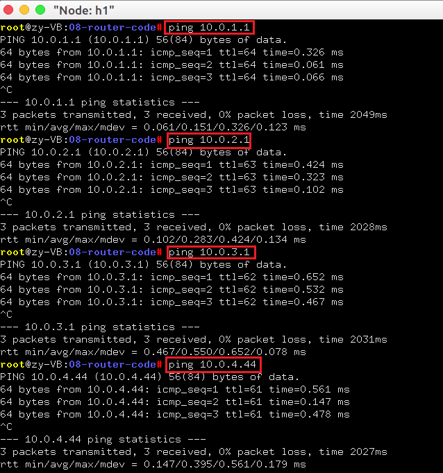
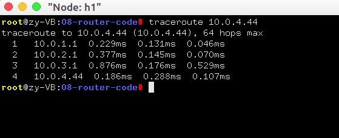

# 路由器转发实验

# 实验内容

- **在主机上安装arptables, iptables，用于禁止每个节点的相应功能**  
    终端执行命令  
    `sudo apt install arptables iptables`

- **运行给定网络拓扑(router_topo.py)**
  - 路由器节点r1上执行脚本(disable_arp.sh, disable_icmp.sh, disable_ip_forward.sh)，禁止协议栈的相应功能
  - 终端节点h1-h3上执行脚本disable_offloading.sh
  - 在r1上执行路由器程序
  - 在h1上进行ping实验

- **构造一个包含多个路由器节点组成的网络**
  - 手动配置每个路由器节点的路由表
  - 有两个终端节点，通过路由器节点相连，两节点之间的跳数不少于3跳，手动配置其默认路由表

- **连通性测试**
  - 终端节点ping每个路由器节点的入端口IP地址，能够ping通

- **路径测试**
  - 在一个终端节点上traceroute另一节点，能够正确输出路径上每个节点的IP信息


## 实验步骤
##### 在主机上安装arptables, iptables
- 直接在终端执行`sudo apt install arptables iptables`。

- 安装后的测试结果：`ping`自己子网内的服务器时，不在通过主机在局域网内进行arp查询和转发，而是发给路由器，通过路由器转发。

##### 实现路由器拓扑
按照如下顺序编写代码：
1. 实现IP包转发
2. 实现ARP包处理和ARP缓存操作
3. 实现ICMP包发送

由于代码量较大，此处不再粘贴源码，而主要分析代码结构，以及结合之前的实验做类比总结。

##### 本实验的函数调用关系

  

##### 集线器、交换机和路由器的对比

| | 集线器 | 交换机 | 路由器|
| ---- | ---- | ---- | ---- |
|层级|物理层|链路层|IP层|
|转发依据||MAC地址|IP地址|
|功能|连接网络中的设备|连接网络中的设备|连接不同的网络|
|带宽影响|共享带宽|独享带宽|独享带宽|

##### 转发表、路由表和ARP缓存表的对比
||转发表|路由表|ARP缓存表|
| ---- | ---- | ---- | ---- |
|使用者|交换机|路由器|路由器|
|网络层级|链路层|IP层|链路层和IP层的媒介|
|数据结构|哈希表|链表|数组|
|表项映射|MAC->iface|IP->iface|ip->MAC|
|是否老化|是|否|是|


## 实验结果
#### 1. 在给定网络拓扑(router_topo.py)上进行ping实验


- **终端命令**

  ```
    r1 # ./router
    h1 # ping 10.0.1.1
    h1 # ping 10.0.2.22
    h1 # ping 10.0.3.33
    h1 # ping 10.0.3.11
    h1 # ping 10.0.4.1
  ```

- **运行结果**

  
  
  结果显示，h1能够ping通h2, h3，说明路由器可连通多个局域网；
  
  h1 `ping 10.0.3.11`返回`ICMP Destination Host Unreachable`，说明路由器内没有此网段的路由表项，目的网段不可达；
  
  h1 `ping 10.0.4.1`返回`ICMP Destination Net Unreachable`，说明路由器内没有此网段的路由表项，arp请求发出后无法收到回应，表明目的主机不可达。

#### 2. 构造多路由网络(three_router_topo.py)
- **拓扑示意图**
  
  

##### 2.1 连通性测试

  - **终端命令**

  ```
    r1 # ./router
    r2 # ./router
    r3 # ./router
    h1 # ping 10.0.1.1
    h1 # ping 10.0.2.1
    h1 # ping 10.0.3.1  
    h1 # ping 10.0.4.44  
  ```

- **运行结果**
  
  

  `ping`的结果显示h1能够和沿途端口连通。

##### 2.2 路径测试
  - **终端命令**  
  
    `traceroute 10.0.4.44`

  - **运行结果** 

  

  `h1 traceroute h2`的结果显示了正确的路由器路径。

## 实验记录
1. `ping 10.0.1.1`时显示`Destination Host Unreachable`，原因是`arp_send_reply`中没有对ARP初始化。
2. `ping 10.0.1.1`时程序报错`Aborted(core dumped)`。
   在arp缓存中找到IP->MAC映射时，将该数据包缓存在arpcache->req_list中。该数据包的iface端口项应该使用`malloc`和`memcpy`的方式初始化，不能直接使用`=`赋值。

3.  在多路由器拓扑`h1 ping h2`时，只能传播一个路由器。发现是因为r1发送ARP请求的IP地址有误。不能直接填写目的IP地址，要判断是否为最后一跳，如果是，就填写目的IP地址，否则要填写网关地址。
   因此增添判断语句`u32 next_ip = entry->gw ? entry->gw : daddr;`。

