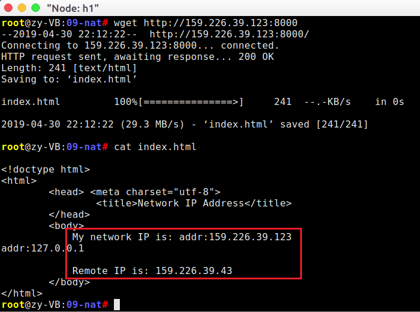

# 网络地址转换(NAT)实验

# 实验内容

### NAT映射表管理

- 维护NAT连接映射表，支持映射的添加、查找、更新和老化操作

### 数据包的翻译操作

- 对到达的合法数据包，进行`IP`和`Port`转换操作，更新头部字段，并转发数据包

- 对于到达的非法数据包，回复`ICMP Destination Host Unreachable`

## 实验步骤

本次实验按照如下流程图进行：


### 1. 区分数据包方向

- 当源地址为内部地址，且目的地址为外部地址时，方向为**DIR_OUT**

- 当源地址为外部地址，且目的地址为`external_iface`地址时，方向为**DIR_IN**

- **判断依据**：查询路由表，根据目的地址相应转发条目对应的iface判断地址类别

- 代码如下：

```c
  static int get_packet_direction(char *packet)
  {
  	fprintf(stdout, "Determine packet direction.\n");
  	struct iphdr *ip = packet_to_ip_hdr(packet);
  	u32 src = ntohl(ip->saddr);
  	u32 dst = ntohl(ip->daddr);
  	rt_entry_t *s_entry = longest_prefix_match(src);
  	rt_entry_t *d_entry = longest_prefix_match(dst);
  
  	if (!strcmp(s_entry->iface->name, nat.internal_iface->name) && \
        !strcmp(d_entry->iface->name, nat.external_iface->name))
  		return DIR_OUT;
  		
  	if (!strcmp(s_entry->iface->name, nat.external_iface->name) && \
        !strcmp(d_entry->iface->name, nat.external_iface->name))
  		return DIR_IN;
  	
  	return DIR_INVALID;
  }
```

### 2. NAT地址翻译

#### 2.1 NAT中有对应连接 (Existing)

- 查找映射关系，进行`(internal_ip, internal_port) <-> (external_ip, external_port)`之间的转换
- 更新IP/TCP数据包头部字段(包括校验和)

#### 2.2 SNAT

- `saddr = external_iface->ip;`     `sport = assign_external_port();`

- 建立连接映射关系：`(internal_ip, internal_port) <-> (external_ip, external_port)`

- 更新IP/TCP数据包头部字段(包括校验和)

- 代码如下：

```c
  u16 assign_external_port()
  {
  	u16 i = NAT_PORT_MIN;
  	for (; i < NAT_PORT_MAX; i ++) {
  		if (!nat.assigned_ports[i]) {
  			nat.assigned_ports[i] = 1;
  			return i;
  		}
  	}
  	return 0;
  }
```

  ```c
  if (dir == DIR_OUT) {
  		list_for_each_entry_safe(mapping_entry, entry, head, list) 
        {
  			if (mapping_entry->internal_ip == saddr && \
                mapping_entry->internal_port == sport) {
  				found = 1;
  				break;
  			}
  		}
  		// build a new mapping
  		if (!found) {
  			mapping_entry = (struct nat_mapping *)malloc(sizeof(struct nat_mapping));
  			init_list_head(&mapping_entry->list);
  			mapping_entry->internal_ip = saddr;
  			mapping_entry->internal_port = sport;
  			mapping_entry->external_ip = nat.external_iface->ip;
  			mapping_entry->external_port = assign_external_port();
  			mapping_entry->remote_ip = daddr;
  			mapping_entry->remote_port = dport;
  			mapping_entry->update_time = time(NULL);
  			bzero(&(entry->conn), sizeof(struct nat_connection));
  			list_add_tail(&(mapping_entry->list), &(nat.nat_mapping_list[key]));
  		}
      
  		// update mapping
  		mapping_entry->conn.internal_fin = fin | rst;
  		mapping_entry->conn.internal_ack = ack | rst;
  		mapping_entry->conn.external_fin = rst;
  		mapping_entry->conn.external_ack = rst;
  
  		ip->saddr = htonl(mapping_entry->external_ip);
  		tcp->sport = htons(mapping_entry->external_port);
  		ip->checksum = ip_checksum(ip);
  		tcp->checksum = tcp_checksum(ip, tcp);
  	}
  ```

#### 2.3 DNAT

- `daddr = rule->daddr; `     `dport = rule->dport;`
- 建立连接映射关系：`(internal_ip, internal_port) <-> (external_ip, external_port)`

- 更新IP/TCP数据包头部字段(包括校验和)

- 代码如下：

```c
  else if (dir == DIR_IN){
  		found = 0;
  		mapping_entry = NULL;
  		entry = NULL;
  		list_for_each_entry_safe(mapping_entry, entry, head, list) 
        {
  			if (mapping_entry->external_ip == daddr && \
                mapping_entry->external_port == dport) {
  				found = 1;
  				break;
  			}
  		}
  		if (!found) {
  			struct dnat_rule *rule, *q;
  			printf("DIR_IN: non-recorded src.\n");
  			int found_rule = 0;
  			list_for_each_entry_safe(rule, q, &(nat.rules), list) {
  				if (rule->external_ip == daddr && rule->external_port == dport) 
                {
  					printf("DIR_IN: FOUND.\n");
  					found_rule = 1;
  					break;
  				}
  			}
  			if (found_rule) {
  				mapping_entry = (struct nat_mapping *)malloc(sizeof(struct nat_mapping));
  				init_list_head(&mapping_entry->list);
  				mapping_entry->internal_ip = rule->internal_ip;
  				mapping_entry->internal_port = rule->internal_port;
  				mapping_entry->external_ip = rule->external_ip;
  				mapping_entry->external_port = rule->external_port;
  				mapping_entry->remote_ip = saddr;
  				mapping_entry->remote_port = sport;
  				list_add_tail(&(mapping_entry->list), &(nat.nat_mapping_list[key]));
  			}
  		}
      
  		// update mapping
  		mapping_entry->conn.internal_fin = fin;
  		mapping_entry->conn.internal_ack = ack;
  		mapping_entry->conn.external_fin = fin | rst;
  		mapping_entry->conn.external_ack = ack | rst;
  
  		ip->daddr = htonl(mapping_entry->internal_ip);
  		tcp->dport = htons(mapping_entry->internal_port);		
  		ip->checksum = ip_checksum(ip);
  		tcp->checksum = tcp_checksum(ip, tcp);
  	}
  	ip_send_packet(packet, len);

  	pthread_mutex_unlock(&nat.lock);
  }
```

#### 2.4 IVALID

- 回复ICMP目的主机不可达

### 3. 转发数据包

- `ip_send_packet(packet, len);`

### 4. NAT老化操作

- 对于已经结束的连接，收回已分配的端口号，释放连接映射资源

  - 双方都已发送FIN且回复相应ACK的连接，可以直接回收
  - 一方发送RST包的连接，可以直接回收
  - 双方已经超过60秒未传输数据的连接，认为其已经传输结束，可以回收

- 代码如下;

```c
  void *nat_timeout()
  {
  	while (1) {
  		pthread_mutex_lock(&nat.lock);
  		for (int i = 0; i < HASH_8BITS; i ++) {
  			struct list_head *head = &nat.nat_mapping_list[i];
  			struct nat_mapping *mapping_entry, *entry;
  			list_for_each_entry_safe(mapping_entry, entry, head, list) 
            {
  				mapping_entry->update_time += 1;
  				if (time(NULL) - mapping_entry->update_time > TCP_ESTABLISHED_TIMEOUT ||\
                    is_flow_finished(&mapping_entry->conn)) 
                {
  					nat.assigned_ports[mapping_entry->external_port] = 0;
  					list_delete_entry(&mapping_entry->list);
  					free(mapping_entry);
  					fprintf(stdout, "Sweep aged connection.\n");
  				}
  			}
  		}
  		pthread_mutex_unlock(&nat.lock);
  		sleep(1);
  	}
  	return NULL;
  }
```

### 5. NAT退出操作

- 退出NAT时的操作：删除释放mapping，结束nat_timeout进程

- 代码如下：

```c
  void nat_exit()
  {
  	pthread_mutex_lock(&nat.lock);
  	for (int i = 0; i < HASH_8BITS; i ++) {
  		struct list_head *head = &nat.nat_mapping_list[i];
  		struct nat_mapping *mapping_entry, *entry;
  		list_for_each_entry_safe(mapping_entry, entry, head, list) 
        {
  			list_delete_entry(&mapping_entry->list);
  			free(mapping_entry);
  		}
  	}
  	pthread_kill(nat.thread, SIGTERM);
      
  	pthread_mutex_unlock(&nat.lock);
  }
```

## 实验结果

### 1. SNAT实验

#### 验证方法

- 运行给定网络拓扑(nat_topo.py)

- 在n1, h1, h2, h3上运行相应脚本:

```shell
  n1   # disable_arp.sh, disable_icmp.sh, disable_ip_forward.sh, disable_ipv6.sh
  
  h1-h3# disable_offloading.sh, disable_ipv6.sh
```

- 在n1上运行nat程序：  `n1# ./nat`

- 在h3上运行HTTP服务：`h3# python ./http_server.py`

- 在h1, h2上分别访问h3的HTTP服务

```shell
  h1# wget http://159.226.39.123:8000（公网）
  
  h2# wget http://159.226.39.123:8000
```

#### 获取网页



#### 抓包结果


#### 结果分析

​	内网h1和h2经过n1的正确转换，成功访问了外网h3的HTTP服务。

### 2. DNAT实验

#### 验证方法

- 运行给定网络拓扑`nat_topo.py`

- 在n1, h1, h2, h3上运行相应脚本

```shell
  n1   # disable_arp.sh, disable_icmp.sh, disable_ip_forward.sh, disable_ipv6.sh
  
  h1-h3# disable_offloading.sh, disable_ipv6.sh
```

- 在n1上运行nat程序： `n1# ./nat`

- 在h1, h2上分别运行HTTP Server：   `h1/h2# python ./http_server.py`

- 在h3上分别请求h1, h2页面

```shell
  h3# wget http://159.226.39.43:8000
  
  h3# wget http://159.226.39.43:8001
```

#### 获取网页


#### 抓包结果


#### 结果分析

​	外网h3经过n1的正确转换，成功访问了内网h1和h2的HTTP服务。

### 3. 构造一个包含两个nat的拓扑

#### 验证方法

- 结点连接方式：`h1 <-> n1 <-> n2 <-> h2`
- 节点n1作为SNAT， n2作为DNAT，主机h2提供HTTP服务，主机h1穿过两个nat连接到h2并获取相应页面
- 代码见文件 `two_nat_topo.py`，H1和H2的配置文件分别为`nat1_config.txt`和`nat2_config.txt`。
- 构造的拓扑原理图如下图所示：


#### 获取网页


#### 抓包结果


#### 结果分析

​	由以上结果知，NAT1和NAT2正确完成了地址转换，h1成功访问了h2的HTTP服务。

## 实验记录

​	注意在运行自己构造的NAT拓扑之前，需要修改`nat.c`中`parse_config`函数中读取`internal_iface`和`external_iface`的部分代码，以正确读取NAT2的配置文件。