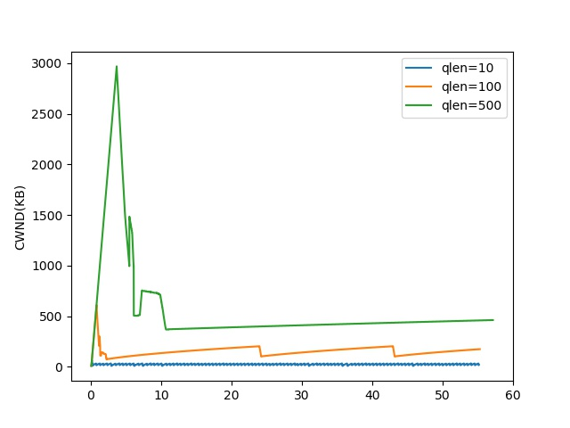
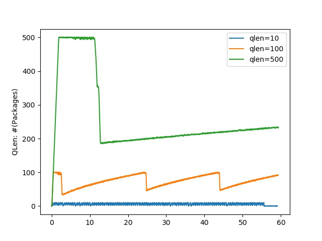
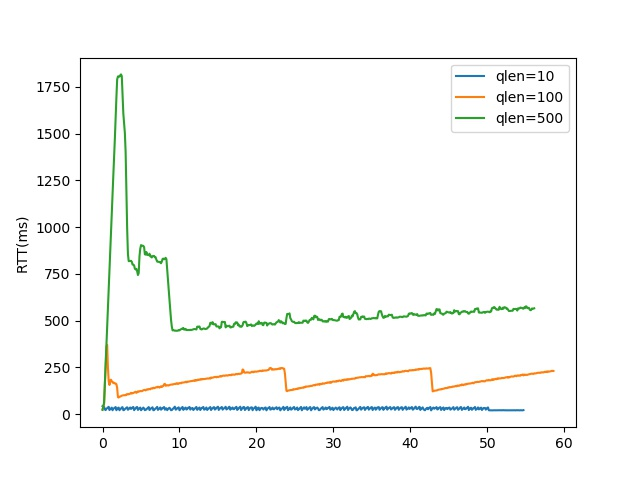
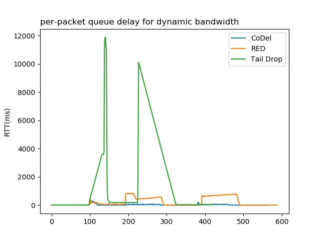
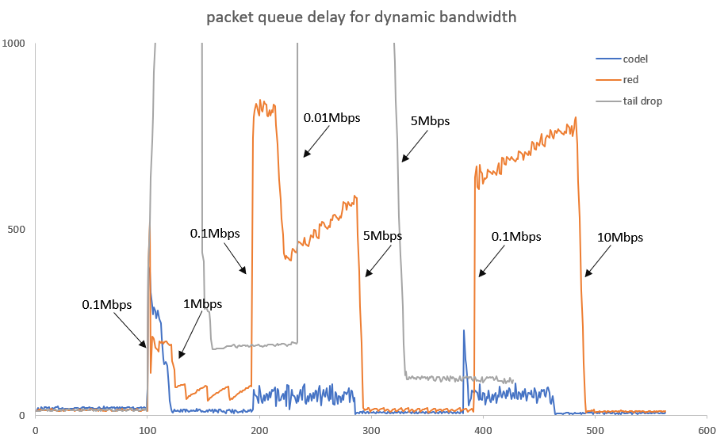

# 数据包队列管理实验报告 
- - -
## 实验内容

- 根据附件材料中提供的脚本，重现如下实验结果：
  - h1(发送方)在对h2进行iperf的同时，测量h1的拥塞窗口值、r1-eth1的队列长度、h1与h2间的往返延迟
  - 改变r1-eth1的队列大小，考察其对iperf吞吐率和ping延迟的影响
  - 使用CoDel、Red、Tail Drop三种方法解决BufferBloat问题，重现带宽对ping延迟的影响

## 实验步骤

#### 生成实验数据

- 在Linux终端执行如下命令：

  ```shell
  # 重现BufferBloat问题
  sudo python reproduce_bufferbloat.py -q X  # X为队列长度，此次实验取X=10，50，100
  # 解决BufferBloat问题
  sudo python mitigate_bufferbloat.py -a X  # X为使用的算法，X=codel, red, taildrop
  ```

#### 处理数据，绘制图表

- 编写`runme.py`，从上一步生成的`txt`文件中提取关键数据，绘制折线图，重现实验结果。图存于

## 实验结果

#### 队列大小对iperf吞吐率和ping延迟的影响

- 取队列长度分别为10、100、500进行测试

- h1的拥塞窗口值

  

- r1-eth1的队列长度

  

- h1与h2间的往返延迟

  

#### 解决BufferBloat问题--带宽对ping延迟的影响

- 使用三种算法解决BufferBloat问题，ping延迟如下

  

- 局部放大，重现带宽对ping延迟的影响

  

## 结果分析

#### 重现BufferBloat现象

- 随着r1-eth1的队列长度的增大，h1拥塞窗口、r1-eth1的队列长度、h1和h2之间的往返延迟均增大，且在开始阶段有一段急剧的增加，重现了bufferbloat现象。

- 由于TCP的传输机制，三张图中变量均呈现周期性的锯齿状，即只要没有丢包，TCP就会试图增大拥塞窗口大小，相应的队列长度和往返延迟也会增大；遇到丢包的拥塞信号后，就会减小窗口大小。

- r1-eth1的队列大小对iperf吞吐率的影响：

  

  由图像知，在一定范围内，随着队列的增大，吞吐率逐渐增大；当队列长度超过一定范围，吞吐率反而减小。

  在一定范围内，由于TCP传输的拥塞控制算法包含慢启动机制，逐渐增加拥塞窗口，队列增大会使得全速传输的比例更大，吞吐率有所增加；但是当队列长度过大时，会出现BufferBloat现象，数据包在缓冲区中存留时间过长引起的延迟过大，窗口再增大不会增大吞吐率，只会增加延迟。

#### 解决BufferBloat问题

- **Tail Drop**：使用FIFO算法，当队列满时，将新到达的数据包丢弃。在该算法下，队列缓冲区基本为满载状态，因此大多数数据包需要等待链路传输整个队列的时间，图中此算法的延迟最大，极值接近12s。

- **RED**(Random Early Detection)：在队列满之前，就开始主动丢包。该算法的延迟小于Tail Drop算法。

- **CoDel**(Controlling Delay)：当包停留时间超过target值时，将该数据包丢弃。该算法的队列延迟最小，且速率较为稳定。

- 由局部放大图可观察到带宽对ping延迟的影响，带宽的局部极小值对应延迟的局部极大值，带宽的局部极大值对应延迟的局部极小值，两者呈负相关。由于周期性的发送队列增大时，会使带宽急剧降低。

