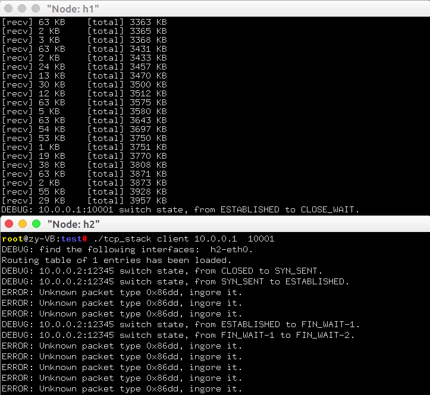
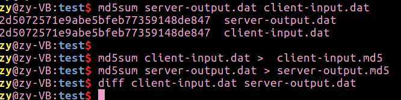
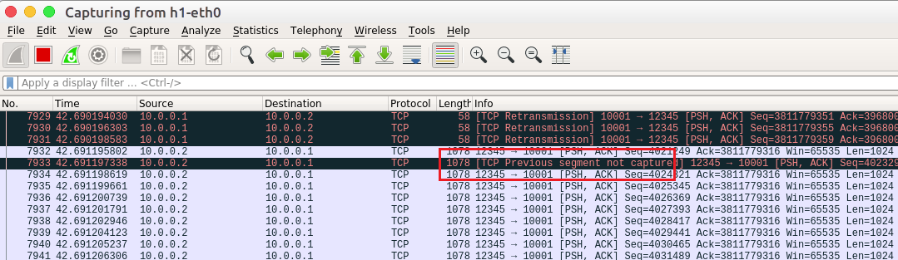
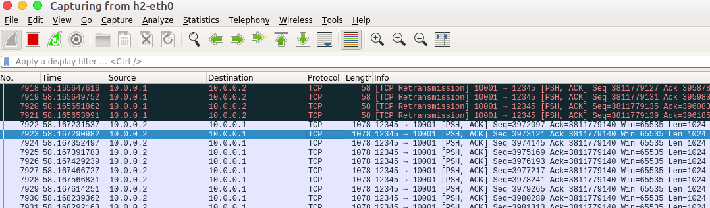

# 16-网络传输机制实验三报告 
- - -
## 实验内容

- 给定网络拓扑和节点配置，实现基于**超时重传**的TCP可靠数据传输，使得结点之间在有丢包网络中能够建立连接并正确传输数据

  

## 实验步骤

#### （1）发送队列

- 所有未确认的数据/SYN/FIN包，在收到其对应的ACK之前，都要放在发送队列`snd_buffer`（链表实现）中，以备后面可能的重传

- 发送队列数据结构：

  ```c
  struct tcp_snd_buf{
  	int size;
  	pthread_mutex_t lock;
  	pthread_t thread_retrans_timer;
  	struct list_head list;
  } snd_buf;
  ```

- 发送新的数据时，放到`snd_buffer`队尾，打开定时器

  ```c
  void add_pkt_to_snd_buf(char* packet,int len){
  	char* packet_copy = (char*)malloc(len);
  	memcpy(packet_copy, packet, len);
  	struct tcp_buf_copy* block = new_tcp_buf_block();
  	block->len = len;
  	block->packet = packet_copy;
  	int tcp_data_len = len- ETHER_HDR_SIZE - IP_BASE_HDR_SIZE - TCP_BASE_HDR_SIZE; 
  	pthread_mutex_lock(&snd_buf.lock);
  	snd_buf.size += tcp_data_len;
  	list_add_tail(&block->list, &snd_buf.list);
  	pthread_mutex_unlock(&snd_buf.lock);
  }
  ```

- 收到新的ACK，将`snd_buffer`中`seq_end <= ack`的数据包移除，并更新定时器

  ```c
  void snd_buf_rcv_ack(struct tcp_sock *tsk, u32 ack){
  	struct tcp_buf_copy *block,*block_q;
  	list_for_each_entry_safe(block, block_q, &snd_buf.list, list){
  		struct iphdr *ip = packet_to_ip_hdr(block->packet);
  		struct tcphdr *tcp = (struct tcphdr *)((char *)ip + IP_BASE_HDR_SIZE);
  		int ip_tot_len = block->len - ETHER_HDR_SIZE;
  		int tcp_data_len = ip_tot_len - IP_BASE_HDR_SIZE - TCP_BASE_HDR_SIZE;
  
  		u32 seq = ntohl(tcp->seq);
  		if( (less_than_32b(seq, ack)) ){
  			pthread_mutex_lock(&snd_buf.lock);
  			snd_buf.size -= tcp_data_len;
  			list_delete_entry(&block->list);
  			pthread_mutex_unlock(&snd_buf.lock);
  
  			free(block->packet);
  			free(block);
  		}
  	}
  }
  ```

- 重传定时器触发时，重传`snd_buffer`中第一个数据包，定时器数值翻倍

  ```c
  
  void retrans_snd_buf(struct tcp_sock *tsk){
  	if(list_empty(&snd_buf.list))
  		return;
  	struct tcp_buf_copy *first_block = list_entry(snd_buf.list.next,struct tcp_buf_copy, list);
  	char* packet = (char*)malloc(first_block->len);
  	memcpy(packet, first_block->packet, first_block->len);
  	struct iphdr *ip = packet_to_ip_hdr(packet);
  	struct tcphdr *tcp = (struct tcphdr *)((char *)ip + IP_BASE_HDR_SIZE);
  
  	tcp->ack = htonl(tsk->rcv_nxt);
  	tcp->checksum = tcp_checksum(ip, tcp);
  	ip->checksum = ip_checksum(ip);	
  	ip_send_packet(packet, first_block->len);
  }
  ```


### （2）接收队列

- 接收队列数据结构：

  ```
  struct tcp_ofo_copy {
  	struct list_head list;
  	u32 seq;
  	u32 len; 
  	char* data;
  };
  ```

  

- 数据接收方连续收到的数据，放在`rcv_ring_buffer`中供app读取

  ```c
  void add_ofo_buf(struct tcp_sock *tsk, struct tcp_cb *cb, char *packet){
  	struct tcp_ofo_copy* new_ofo_block = (struct tcp_ofo_copy*)malloc(sizeof(struct tcp_ofo_copy));
  	new_ofo_block->seq = cb->seq;
  	new_ofo_block->len = cb->pl_len;
  	new_ofo_block->data = (char*)malloc(cb->pl_len);
  	char* data_start = packet +ETHER_HDR_SIZE +IP_BASE_HDR_SIZE +TCP_BASE_HDR_SIZE;
  	memcpy(new_ofo_block->data, data_start, cb->pl_len);
  	int is_inserted = 0;
  	struct tcp_ofo_copy *block, *block_q;
  	list_for_each_entry_safe(block, block_q, &tsk->rcv_ofo_list, list){
  		if(less_than_32b(new_ofo_block->seq , block->seq)){
  			list_add_tail(&new_ofo_block->list, &block->list);
  			is_inserted = 1;
  			break;
  		}
  	}
  	if(!is_inserted){ 
  		list_add_tail(&new_ofo_block->list, &tsk->rcv_ofo_list);
  	}
  }
  ```

- 收到不连续的数据，放到`rcv_ofo_buffer`队列（链表实现），如果队列中包含了连续数据，则将其移到`rcv_ring_buffer`中

  ```c
  int remove_ofo_buf(struct tcp_sock *tsk){
  	u32 seq = tsk->rcv_nxt;
  	struct tcp_ofo_copy *block, *block_q;
  	list_for_each_entry_safe(block, block_q, &tsk->rcv_ofo_list, list){
  		if((seq == block->seq)){
  			while(block->len > ring_buffer_free(tsk->rcv_buf) ){
  				fprintf(stdout, "s ");
  				if(sleep_on(tsk->wait_recv)<0){
  					return -1;
  				}
  				fprintf(stdout, "w ");
  			}
  			write_ring_buffer(tsk->rcv_buf, block->data, block->len);
  			wake_up(tsk->wait_recv);
  			seq += block->len;
  			tsk->rcv_nxt = seq;
  			list_delete_entry(&block->list);
  			free(block->data);
  			free(block);
  			continue;
  		}
  		else if(less_than_32b(seq, block->seq)){ 
  			break;
  		}
  		else{ 
  			return -1;
  		}
  	}
  	return 0;
  }
  ```

  

#### （3）超时重传实现

- 在tcp_sock中维护定时器`struct tcp_timer retrans_timer`

  ```c
  void *tcp_retrans_timer_thread(void *arg){
  	init_list_head(&retrans_timer_list);
  	while(1){
  		usleep(RETRANS_SCAN_TIMER);
  		tcp_scan_retrans_timer_list();
  	}
  }
  ```

- 当开启定时器时，将`retrans_timer`放到`timer_list`中

  ```c
  void tcp_set_retrans_timer(struct tcp_sock *tsk)
  {
  	struct tcp_timer *timer = &tsk->retrans_timer;
  
  	timer->type = 0;
  	timer->timeout = DEFAULT_RETRANS_TIME;
  	timer->retrans_times = 0;
  	init_list_head(&timer->list);
  	list_add_tail(&timer->list, &retrans_timer_list);
  	tsk->ref_cnt ++;
  }
  ```

  

- 关闭定时器时，将`retrans_timer`从`timer_list`中移除

  ```c
  void tcp_unset_retrans_timer(struct tcp_sock *tsk)
  {
  	struct tcp_timer *timer = &tsk->retrans_timer;
  	list_delete_entry(&timer->list);
  	free_tcp_sock(tsk);
  }
  ```

- 定时器扫描，建议每10ms扫描一次定时器队列，重传定时器的值为200ms * 2^N

  ```c
  void tcp_scan_retrans_timer_list()
  {
  	struct tcp_sock *tsk;
  	struct tcp_timer *p, *q;
  	list_for_each_entry_safe(p, q, &retrans_timer_list, list) {
  		p->timeout -= RETRANS_SCAN_TIMER;
  		tsk = retrans_timer_to_tcp_sock(p);
  		if(p->timeout <= 0){
  			if(p->retrans_times>=MAX_RETRANS){
  				list_delete_entry(&p->list);
  				if (! tsk->parent)
  					tcp_bind_unhash(tsk);
  				wait_exit(tsk->wait_connect);
  				wait_exit(tsk->wait_accept);
  				wait_exit(tsk->wait_recv);
  				wait_exit(tsk->wait_send);
  				
  				tcp_set_state(tsk, TCP_CLOSED);
  				free_tcp_sock(tsk);
  				free_snd_buf();
  				exit(0);
  			}
  			else{
  				p->retrans_times += 1;
  				p->timeout = DEFAULT_RETRANS_TIME * (2 << p->retrans_times);
  				retrans_snd_buf(tsk);
  			}
  		}
  	}
  }
  ```


#### （4）其他修改

- ` tcp_sock_read`：如果对端的写数据已经发送完，则无法接收数据，被阻塞；直到对端`close`,  本端会唤醒被阻塞的`read`进程，并且从`while`循环中跳出。

  ```c
  int tcp_sock_read(struct tcp_sock *tsk, char *buf, int len){
  	while( ring_buffer_empty(tsk->rcv_buf) ){
  		if( sleep_on(tsk->wait_recv)<0 ){
  			tcp_unset_retrans_timer(tsk);
  			return -1;
  		}
  	}
  	// pthread_mutex_lock(&tsk->rcv_buf_lock);
  	int rlen = read_ring_buffer(tsk->rcv_buf, buf, len); 
  	// pthread_mutex_unlock(&tsk->rcv_buf_lock);
  	wake_up(tsk->wait_recv);
  	tcp_unset_retrans_timer(tsk);
  	return rlen;
  }
  ```

- `tcp_sock_write`：

  ```c
  int tcp_sock_write(struct tcp_sock *tsk, char *buf, int len){
  	int tmp = len; 
  	int offset = 0;
  	tcp_set_retrans_timer(tsk); 
  	while(tmp) {
  		int send_len = min(tmp, 1024);
  		while(snd_buf.size + send_len > tsk->snd_wnd){ 
  			if(sleep_on(tsk->wait_send) < 0){
  				tcp_unset_retrans_timer(tsk);
  				return -1;
  			}
  		}
  		tcp_send_data(tsk, buf+offset, send_len );
  		offset += send_len;
  		tmp -= send_len;
  	}
  	while(snd_buf.size>0)sleep_on(tsk->wait_send);
  
  	tcp_unset_retrans_timer(tsk); 
  	return 0;
  }
  ```

  需要增添开启、关闭计时器的操作；发完数据后，发送缓冲区没确认完之前需要阻塞。

- `数据发送过程`：发送新的数据时，放到`snd_buffer`队尾；打开计时器。

- `数据接收过程`：由于ACK包不占用序列号，在确认数据时，不使用ACK数据包，而是发送一个自定义的TCP包，数据包的内容为`yes`。

  

## 实验结果

- 执行`create_randfile.sh`，生成待传输数据文件`client-input.dat`

- 运行给定网络拓扑`tcp_topo_loss.py`

- 在节点`h1`上执行TCP程序

  - 执行脚本`disable_offloading.sh` ,` disable_tcp_rst.sh`，禁止协议栈的相应功能
  - 在`h1`上运行TCP协议栈的服务器模式 ` ./tcp_stack server 10001`

- 在节点`h2`上执行TCP程序

  - 执行脚本`disable_offloading.sh, disable_tcp_rst.sh`，禁止协议栈的相应功能
  - 在`h2`上运行TCP协议栈的客户端模式 `./tcp_stack client 10.0.0.1 10001`
    - Client发送文件`client-input.dat`给server，server将收到的数据存储到文件`server-output.dat`

  

- 使用`md5sum`比较两个文件是否完全相同

  

- 使用`wireshark`抓包

  

  上图中体现了server丢包现象。

  

  上图体现了client对没有被确认的包进行超时重传。